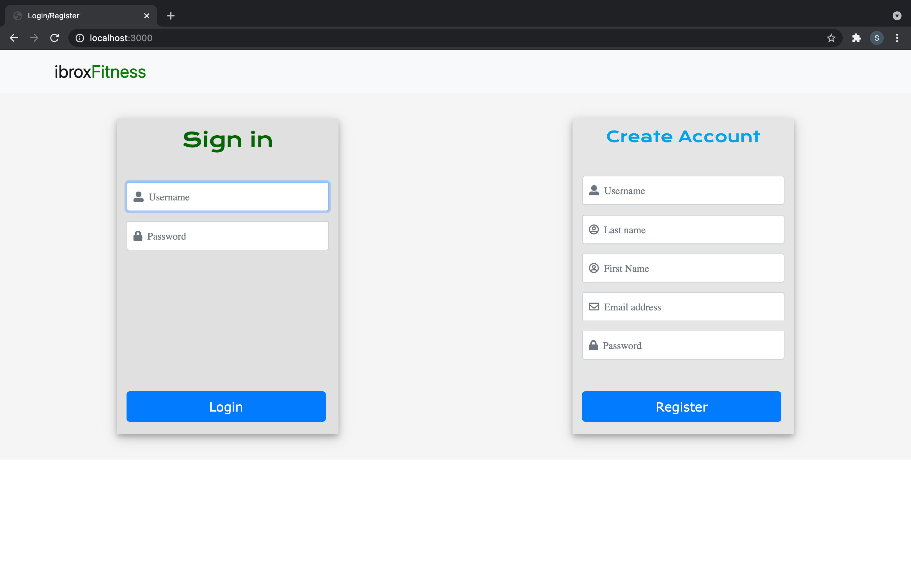
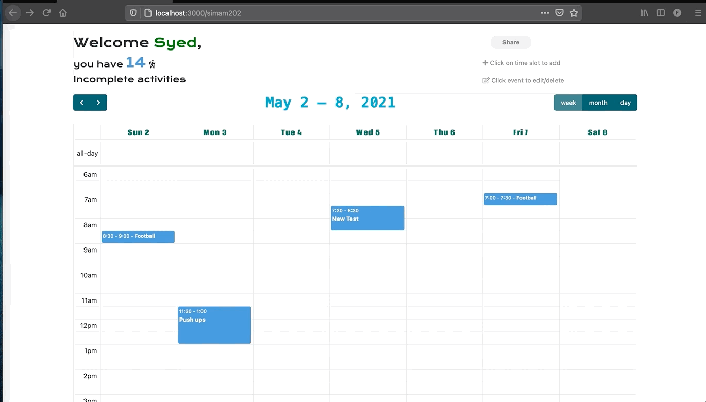

# ibroxFitness

## About the Project

Staying physically healthy and getting enough exercise is difficult in the present COVID scenario. The developed application helps the individual to create their own weekly activities schedule. Users of the app will also keep track of their actual achievements. The activities and achievements are confidential, which means they are only available to the logged-in person. 

<hr>

## Run Application

Use the run command or nodemon index to run application.

```bash
npm run install
OR
nodemon index
```
<hr>

## Usage

The login and Register page is the ibroxFitness landing page. New users can register with their information, while returning users can simply login.



<hr>

## Activities Page

The Activities page can be used to display three separate calendar views, including weekly, monthly, and daily. 
Activities for the upcoming and previous weeks can also be viewed.


### Add an activity:
click on a time slot on the calendar, which will automatically select a date and time. This time can also be updated using the date range picker in the add activity modal.


### Edit an activity:
When you click on a certain activity on the calendar, the edit modal opens with saved fields already in the input fields. Changed fields will be saved once the update button is pressed. When an activity is over, press completed to add it to the achievements. The Delete button is used to remove an activity.


### Share Schedule: 
To share, simply click the share button, which will copy the share link to your clipboard.



<hr>

## Achievements Page

The Achievements page compares unfinished and completed activities. To distinguish them, they are colour coded.


<hr>

## Contact 

Syed Faisal Imam - simam202@caledonian.ac.uk
Glasgow Caledonian University

<hr>

## Acknowledgements

[Bootstrap](https://getbootstrap.com)
[fullCalendar](https://fullcalendar.io)
[JQuery](https://jquery.com)
[moment.js](https://momentjs.com)
[Date Range Picker](https://www.daterangepicker.com)
[Font Awsome](https://fontawesome.com)
[connect-flash](https://www.npmjs.com/package/connect-flash)


